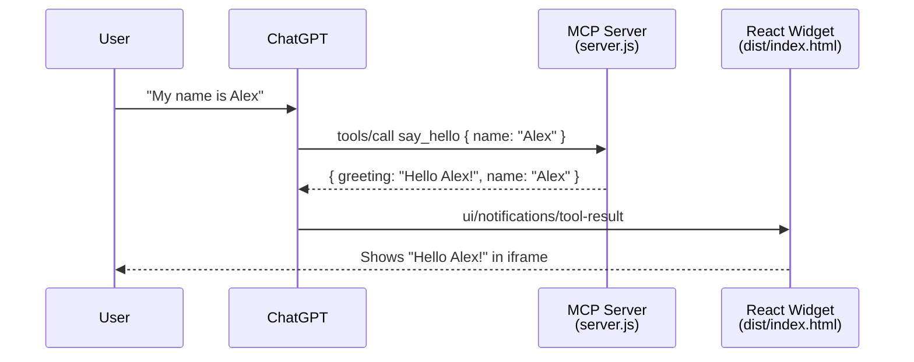

# ChatGPT App Demo — Hello World

A minimal beginner template for building a [ChatGPT app](https://developers.openai.com/apps-sdk/quickstart) using the **Apps SDK** and **Model Context Protocol (MCP)**.

When a user tells ChatGPT their name, the app calls the `say_hello` tool and displays **Hello {name}!** in a React widget inside ChatGPT.

## What you get

| Piece | Technology | Purpose |
|-------|------------|---------|
| MCP server | Express + `@modelcontextprotocol/sdk` | Exposes tools and UI resources to ChatGPT |
| Widget UI | React + Vite | Renders the greeting card in ChatGPT's iframe |
| Bridge | `@modelcontextprotocol/ext-apps` | Connects the widget to ChatGPT via MCP Apps standard |

## Project structure

```
chatgpt-app-demo/
├── server.js          # Express app + MCP endpoint (start here)
├── config.js          # Port, paths, CSP settings
├── widget.js          # Loads and registers the React UI
├── tools/
│   └── show-horoscope.tool.js
├── index.html         # Vite entry point
├── vite.config.ts     # Builds React into dist/
├── src/
│   ├── App.tsx        # React widget (uses useApp hook)
│   ├── main.tsx       # React mount point
│   └── index.css      # Widget styles
└── dist/              # Built widget (generated by npm run build)
```

## Architecture



**Flow in plain English:**

1. **You** add this app as a connector in ChatGPT (Settings → Connectors).
2. **ChatGPT** reads the `say_hello` tool definition from the MCP server.
3. When you share your name, **ChatGPT** calls `say_hello` with your name.
4. The **MCP server** returns a text reply and `structuredContent` for the UI.
5. The **React widget** receives the result via the MCP Apps bridge and displays the greeting.

## Prerequisites

- [Node.js](https://nodejs.org/) 18 or later
- A [ChatGPT](https://chatgpt.com/) account with **Developer mode** enabled
- (For local testing in ChatGPT) [ngrok](https://ngrok.com/) or similar tunnel

## Quick start

### 1. Install dependencies

```bash
cd chatgpt-app-demo
npm install
```

### 2. Build the React widget

Vite builds React into separate files under `dist/`:

```
dist/
├── index.html
└── assets/
    ├── index-[hash].js
    └── index-[hash].css
```

The MCP server serves `index.html` to ChatGPT and hosts the JS/CSS assets via Express static file serving.

```bash
npm run build
```

### 3. Start the MCP server

```bash
npm start
```

You should see:

```
Hello World MCP server listening on http://localhost:3000/mcp
```

### 4. Test locally with MCP Inspector (optional)

```bash
npx @modelcontextprotocol/inspector@latest --server-url http://localhost:3000/mcp --transport http
```

In the inspector, call the `say_hello` tool with `{ "name": "Alex" }` and confirm the response.

### 5. Expose to the internet with ngrok (for ChatGPT)

ChatGPT needs a public HTTPS URL. Use the built-in ngrok script (same pattern as `travel-agent/packages/mcp-funnel`):

```bash
npm run start:ngrok
```

**Prerequisites:** ngrok installed with a reserved domain on your account. Auth is read from your global ngrok config (`~/Library/Application Support/ngrok/ngrok.yml` on macOS) — no `.env` token needed.

Override the default reserved host if needed:

```bash
NGROK_DOMAIN=my-demo.ngrok.dev npm run start:ngrok
```

The script will:

1. Build the widget (`npm run build`)
2. Start the MCP server with `BASE_URL` set to your reserved ngrok host
3. Open an ngrok tunnel via `ngrok start` (merged user + temp config)
4. Print the **MCP connector URL** to paste into ChatGPT

### 6. Add the connector in ChatGPT

1. Enable **Developer mode**: Settings → Apps & Connectors → Advanced settings.
2. Go to **Settings → Connectors → Create**.
3. Paste your public URL with `/mcp`.
4. Name it (e.g. "Hello World Demo") and save.

### 7. Try it in a chat

1. Open a new chat.
2. Add your connector from the **+** menu → **More**.
3. Say: **"My name is Alex"** or **"Say hello to me, I'm Sam"**.

ChatGPT calls `say_hello` and the widget shows **Hello Alex!** (or your name).

## Development workflow

| Task | Command |
|------|---------|
| Edit widget UI | Change files in `src/`, then `npm run build` |
| Edit tools/server | Change `server.js`, restart with `npm start` |
| Preview widget locally | `npm run dev` (Vite dev server only; not wired to MCP) |
| Build + start | `npm run build:start` |
| Start with ngrok for ChatGPT | `npm run start:ngrok` |

After changing the MCP server (tools, descriptions, metadata), **refresh** the connector in ChatGPT: Settings → Connectors → select your connector → **Refresh**.

## Key files explained

### `server.js` — entry point (~80 lines)

- Starts Express and listens on `/mcp`
- Creates an MCP server per request and wires up the widget + tools
- Most logic lives in `config.js`, `widget.js`, and `tools/`

### `tools/show-horoscope.tool.js` — horoscope tool

- Defines the `show_horoscope` tool ChatGPT calls with the user's DOB
- Generates zodiac sign and insight points

### `src/App.tsx` — React widget

- Uses `useApp` from `@modelcontextprotocol/ext-apps/react` to connect to ChatGPT
- Shows a loading skeleton, then renders the horoscope card

## Learn more

- [Apps SDK Quickstart](https://developers.openai.com/apps-sdk/quickstart)
- [MCP Server docs](https://developers.openai.com/apps-sdk/concepts/mcp-server)

## License

MIT — use this template freely for learning and experimentation.
