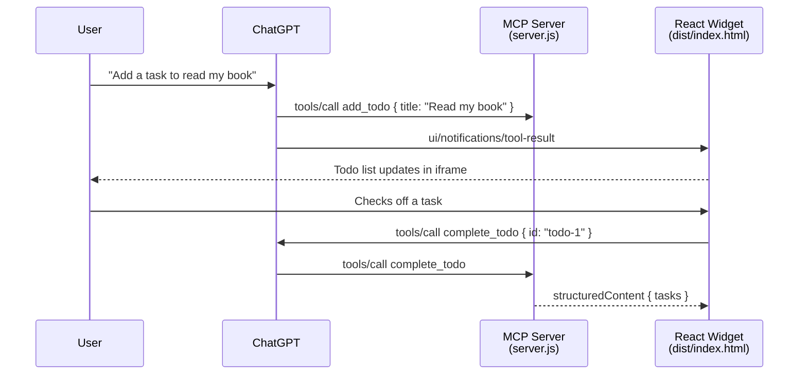

# ChatGPT App Demo — Todo List

A beginner template for building a [ChatGPT app](https://developers.openai.com/apps-sdk/quickstart) using the **Apps SDK** and **Model Context Protocol (MCP)**.

Based on the [Apps SDK quickstart](https://developers.openai.com/apps-sdk/quickstart), this demo exposes `add_todo` and `complete_todo` tools and renders an interactive todo list widget inside ChatGPT.

## What you get

| Piece | Technology | Purpose |
|-------|------------|---------|
| MCP server | Express + `@modelcontextprotocol/sdk` | Exposes tools and UI resources to ChatGPT |
| Widget UI | React + Vite | Renders the todo list in ChatGPT's iframe |
| Bridge | `@modelcontextprotocol/ext-apps` | Connects the widget to ChatGPT via MCP Apps standard |
| Code docs | Static HTML in `docs/` | Walkthrough slides and per-file explanations for workshops |

## Project structure

```
chatgpt-app-demo/
├── server.js          # Express app + MCP endpoint (start here)
├── config.js          # Port, paths, CSP settings
├── widget.js          # Loads and registers the React UI
├── tools/
│   ├── todo-store.js          # shared in-memory task list
│   ├── add-todo.tool.js       # add_todo
│   └── complete-todo.tool.js  # complete_todo
├── src/
│   ├── App.tsx        # React widget (uses useApp hook)
│   ├── main.tsx       # React mount point
│   └── index.css      # Widget styles
├── docs/              # Workshop slides + code walkthrough pages
│   ├── index.html     # Slide deck (start here for docs)
│   ├── server.js      # Local docs server
│   └── …              # Per-topic pages (see below)
├── index.html         # Vite entry point
├── vite.config.ts     # Builds React into dist/
└── dist/              # Built widget (generated by npm run build)
```

## Architecture



**Flow in plain English:**

1. **You** add this app as a connector in ChatGPT (Settings → Connectors).
2. **ChatGPT** reads the `add_todo` and `complete_todo` tool definitions from the MCP server.
3. When you ask to add a task, **ChatGPT** calls `add_todo` with a title.
4. The **MCP server** returns a text reply and `structuredContent` with the full task list.
5. The **React widget** receives results via the MCP Apps bridge and renders the list.
6. You can also add or complete tasks directly in the widget UI.

## Prerequisites

- [Node.js](https://nodejs.org/) 18 or later
- A [ChatGPT](https://chatgpt.com/) account with **Developer mode** enabled
- (For local testing in ChatGPT) [ngrok](https://ngrok.com/) or similar tunnel

## Quick start

### 1. Install dependencies

```bash
cd chatgpt-app-demo
npm install
```

### 2. Build the React widget

```bash
npm run build
```

### 3. Start the MCP server

```bash
npm start
```

You should see:

```
Server running at http://localhost:3000/mcp
```

### 4. Test locally with MCP Inspector (optional)

```bash
npm run inspector
```

Call `add_todo` with `{ "title": "Buy groceries" }`, then `complete_todo` with `{ "id": "todo-1" }`.

### 5. Expose to the internet with ngrok (for ChatGPT)

```bash
npm run start:ngrok
```

### 6. Add the connector in ChatGPT

1. Enable **Developer mode**: Settings → Apps & Connectors → Advanced settings.
2. Go to **Settings → Connectors → Create**.
3. Paste your public URL with `/mcp`.
4. Name it (e.g. "Todo Demo") and save.

### 7. Try it in a chat

1. Open a new chat.
2. Add your connector from the **+** menu → **More**.
3. Say: **"Add a new task to read my book"** or use the widget form directly.

## Code docs (workshop walkthrough)

The `docs/` folder is a self-contained slide deck and reference site that explains how this repo is built — useful for demos, onboarding, and team workshops. It is **not** served by the MCP server; run it separately:

```bash
npm run docs
```

Then open **http://localhost:3333** (override with `DOCS_PORT=4000 npm run docs` if needed).

| Page | What it covers |
|------|----------------|
| [docs/index.html](docs/index.html) | Slide deck — agenda, architecture, data flow, running & testing |
| [docs/building-apps-for-chatgpt.html](docs/building-apps-for-chatgpt.html) | Building blocks, project layout, end-to-end flow |
| [docs/app-tsx.html](docs/app-tsx.html) | `src/App.tsx` — `useApp`, tool events, widget UI |
| [docs/register-app-tool.html](docs/register-app-tool.html) | `registerAppTool` — tool definitions in `tools/` |
| [docs/register-app-resource.html](docs/register-app-resource.html) | `registerAppResource` — widget registration in `widget.js` |
| [docs/widget-uri.html](docs/widget-uri.html) | `WIDGET_URI` — linking tools to the UI resource |
| [docs/widget-csp.html](docs/widget-csp.html) | CSP allowlist — loading JS/CSS from your server |
| [docs/publishing-your-app.html](docs/publishing-your-app.html) | Submission guidelines, tool design, annotations |

> **Note:** Some doc pages still reference the earlier horoscope example in diagrams and copy. The live app code uses the todo tools above; treat those pages as teaching the same patterns with older example names.

## Development workflow

| Task | Command |
|------|---------|
| Edit widget UI | Change files in `src/`, then `npm run build` |
| Edit tools/server | Change `server.js` or `tools/`, restart with `npm start` |
| Preview widget locally | `npm run dev` (Vite dev server only; not wired to MCP) |
| Build + start | `npm run build:start` |
| Start with ngrok for ChatGPT | `npm run start:ngrok` |
| Browse code docs | `npm run docs` → http://localhost:3333 |
| Test MCP tools | `npm run inspector` |

After changing the MCP server (tools, descriptions, metadata), **refresh** the connector in ChatGPT: Settings → Connectors → select your connector → **Refresh**.

## Key files explained

### `server.js` — entry point

- Starts Express and listens on `/mcp`
- Creates an MCP server per request and wires up the widget + tools

### `tools/` — todo tools

- `add-todo.tool.js` — `add_todo`: creates a task with a title (includes LLM-facing description with examples)
- `complete-todo.tool.js` — `complete_todo`: marks a task done by id
- `todo-store.js` — shared in-memory state used by both tools
- Both return `structuredContent.tasks` for the widget

### `src/App.tsx` — React widget

- Uses `useApp` from `@modelcontextprotocol/ext-apps/react`
- Listens for tool results from ChatGPT
- Calls `app.callServerTool` when you add or complete tasks in the UI

## Learn more

- [Apps SDK Quickstart](https://developers.openai.com/apps-sdk/quickstart) — official todo app this demo is based on
- [MCP Server docs](https://developers.openai.com/apps-sdk/concepts/mcp-server)
- In-repo walkthrough: `npm run docs` → http://localhost:3333

## License

MIT — use this template freely for learning and experimentation.
